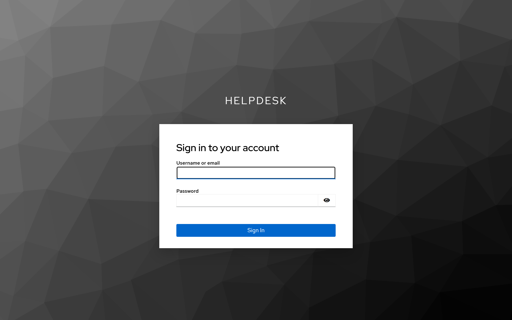
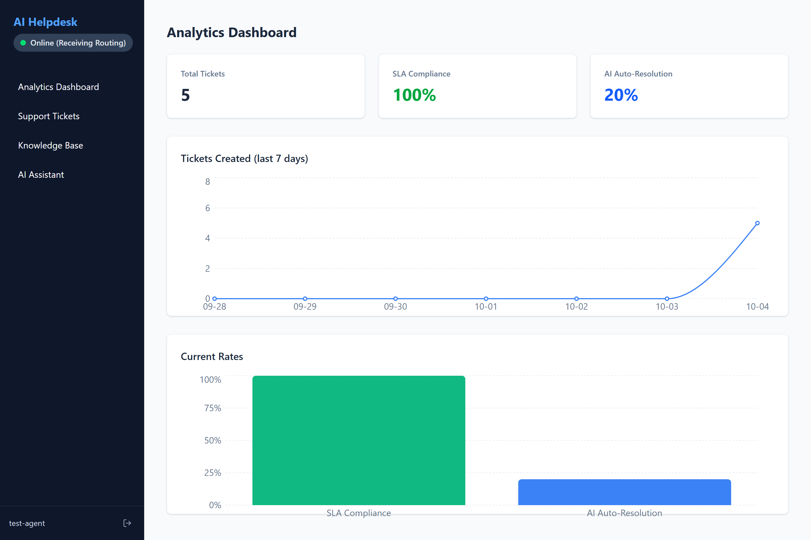
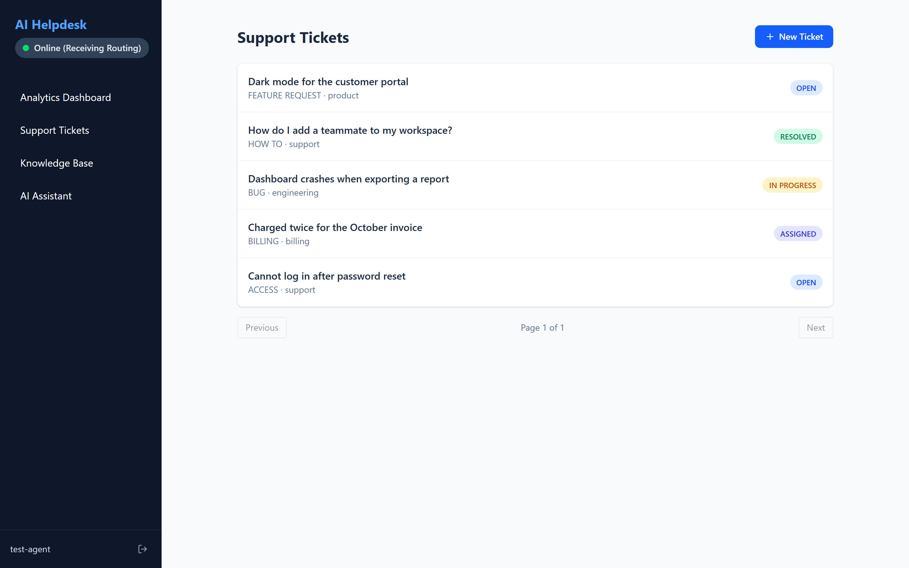
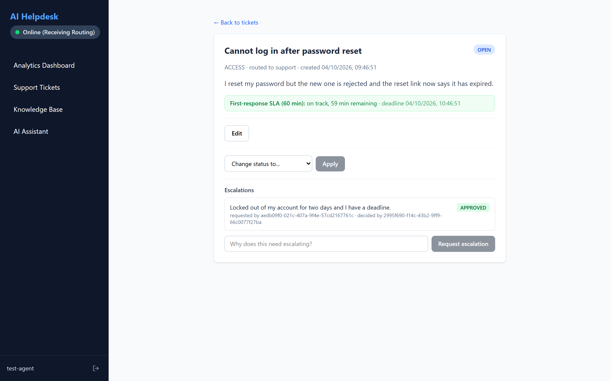
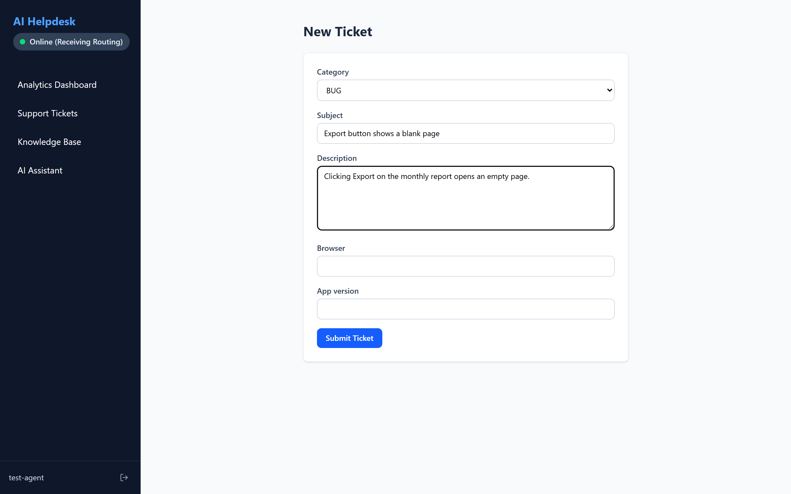
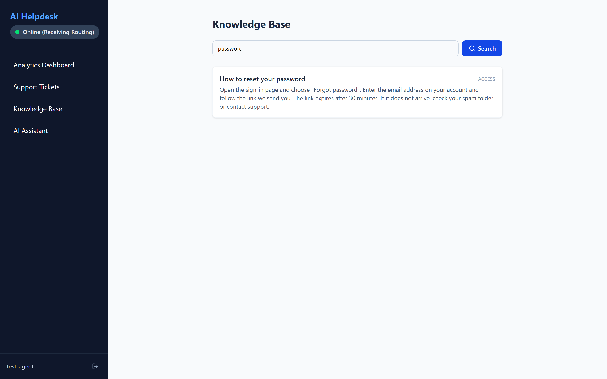
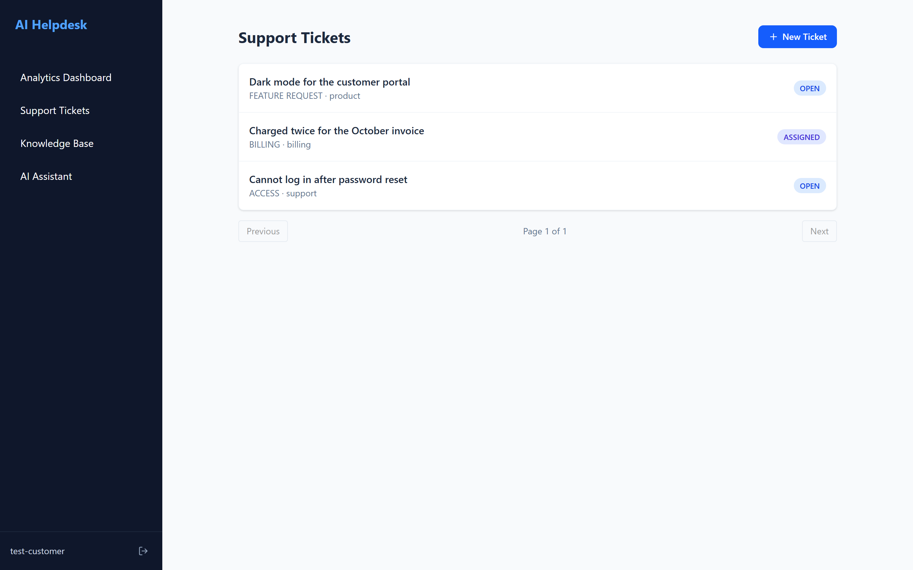
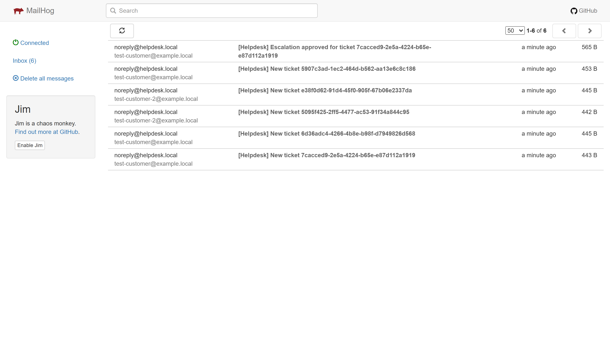
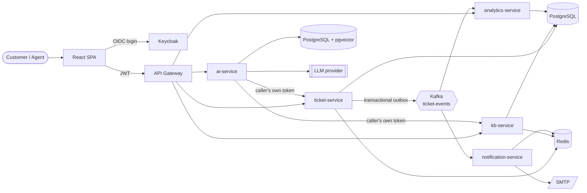
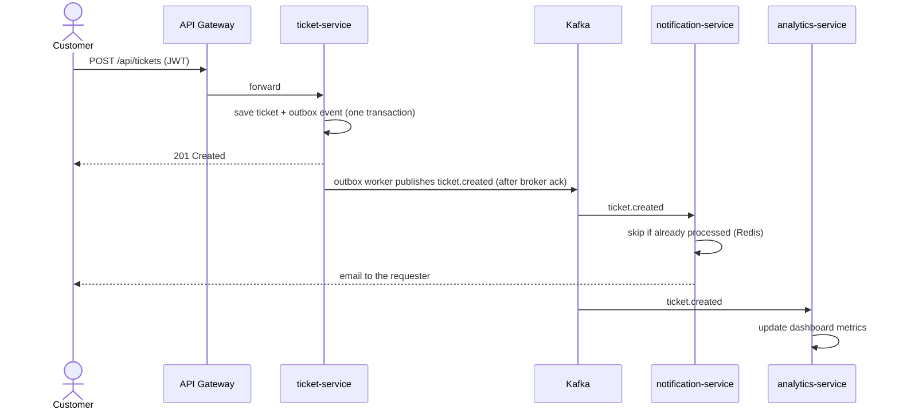

# AI-Powered Helpdesk Platform

A RAG-based support desk built as event-driven microservices — a portfolio project demonstrating Spring Boot, Kafka, Redis, Spring AI, Kubernetes, and AWS end to end. AI is a feature inside a strong backend system, not the whole project: ticket classification, retrieval-augmented draft replies, and an agentic tool-calling assistant sit on top of a properly modeled ticket lifecycle, transactional-outbox event publishing, and full observability.

## Status
Complete and running end to end: ticket lifecycle with human-approved escalations, event-driven email notifications, a knowledge base with hybrid (vector + full-text) search, an AI assistant, and an analytics dashboard. See the [Build Log](#build-log) for the phase-by-phase history and [Post-release hardening](#post-release-hardening-v100-follow-ups) for what was fixed or added afterwards.

## Screenshots
All screenshots are real, taken from the running application with seeded demo data (regenerate them with `scripts/screenshots`).

### Sign-in (Keycloak)
Every page sits behind Keycloak single sign-on; roles (`customer`, `agent`, `admin`) decide what each user can see and do.



### Analytics dashboard (agents)
Ticket volume per day, SLA compliance and the share of tickets the AI resolved on its own. The green dot shows the agent is online and receiving routed tickets.



### Support tickets
Tickets are routed to a team by category and move through a state machine (open, triaged, assigned, in progress, resolved, closed).



### Ticket detail: SLA and human-approved escalation
Shows the first-response SLA countdown, status controls for agents, and the escalation workflow. An escalation requested by the customer (or the AI assistant) has no effect until an agent approves it.



### Creating a ticket
The form asks for the extra details each category needs (for example browser and app version for a bug).



### Knowledge base search
Full-text search over help articles.



### What a customer sees
Customers only see their own tickets, with no agent controls.



### Email notifications
Customers get an email when a ticket is created and when an escalation is approved (shown in MailHog, the local mail catcher at http://localhost:8025).



> The AI assistant page (chat with a tool-calling agent that can look up tickets, check SLAs, search the knowledge base and request escalations) needs an OpenAI API key, so it is not shown here.

## Repository layout
```
common/            shared DTOs, enums, and versioned Kafka event records used by every service
services/         one folder per microservice (ticket, kb, ai, notification, analytics)
infrastructure/    docker, kubernetes, helm, terraform
docs/
  architecture/    diagrams
  api/             endpoint documentation
  kafka/           event schemas and topic design
  rag/             retrieval pipeline and evaluation notes
  database/        schema and entity design
  decisions/       Architecture Decision Records (ADRs) — the "why" behind each major choice
```

## Running locally
```
cp .env.example .env      # fill in local values (never commit .env)
docker compose up -d --build
```
The full stack is 16 containers and needs roughly 6 GB of free RAM. On a smaller machine start only the core services:
```
docker compose up -d --build postgres redis kafka keycloak mailhog ticket-service kb-service notification-service analytics-service api-gateway
cd frontend && npm install && npm run dev      # http://localhost:5173
```
Sign in with one of the seeded test users (`test-agent`, `test-customer`, `test-customer-2`; credentials are in `infrastructure/docker/keycloak/realm-export/helpdesk-realm.json`). See [docs/architecture/keycloak-setup.md](docs/architecture/keycloak-setup.md) for the realm, roles and how to get a token for API calls.

## Architecture


Key ideas:
- **Transactional outbox:** ticket-service writes events to its own database in the same transaction as the change, and a worker publishes them to Kafka only after the broker acknowledges them, so no event is lost or invented.
- **Human in the loop:** the AI assistant can only *request* an escalation. It acts with the caller's own token (so it can never see more than the user could), and nothing happens until an agent approves.
- **Failure handling:** consumers retry, then dead-letter bad messages; notification de-duplication lives in Redis; LLM calls sit behind a circuit breaker.
- **Observability:** OpenTelemetry traces to Tempo, metrics to Prometheus, logs to Loki, all in Grafana.

### Ticket creation to email


## Tech Stack
Java 21 &middot; Spring Boot 4 &middot; Spring Security &middot; Spring Data JPA &middot; Flyway &middot; Spring Cloud &middot; Spring AI &middot; PostgreSQL (+pgvector, full-text search) &middot; Redis &middot; Kafka &middot; Keycloak &middot; Docker &middot; Kubernetes &middot; Helm &middot; Argo CD &middot; Terraform &middot; AWS (EKS, RDS, S3, ElastiCache) &middot; Prometheus &middot; Grafana &middot; OpenTelemetry &middot; React 19 &middot; TypeScript &middot; Tailwind CSS &middot; Loki

See [docs/decisions](docs/decisions) for the reasoning behind key choices, including why PostgreSQL replaces a separate MongoDB store.

## Design Patterns
See [docs/architecture/design-patterns.md](docs/architecture/design-patterns.md) for where each design pattern (State, Strategy, Factory, Observer, Circuit Breaker) is used and why it was chosen over the obvious alternative. Tracked as each one actually ships, not planned ahead of the code.

## Build Log
| Phase | Description |
|---|---|
| Phase 1: Setup | Scaffolded `ticket-service` (Spring Boot 3.2, Java 21, JPA, PostgreSQL, REST controllers). Designed domain model with Strategy/State patterns for ticket routing and lifecycle management. Integrated Keycloak for stateless JWT authentication and role-based access control (Admin, Agent, Customer). Wrote 52 comprehensive unit and integration tests. |
| Phase 2: Core Microservices | Scaffolded `kb-service` with PostgreSQL full-text search (`tsvector`), and a basic `notification-service`. Introduced Flyway for database migrations. Created `api-gateway` (Spring Cloud Gateway) for centralized routing and JWT validation. Containerized all services using multi-stage Dockerfiles and wired them into `docker-compose.yml`. |
| Phase 3: Event-Driven Architecture | Replaced direct REST calls with a Transactional Outbox pattern writing safely to PostgreSQL, polled via OutboxWorker to publish idempotently to a KRaft Kafka cluster. `notification-service` and `analytics-service` now consume these events robustly with DLQ and Retry configurations. Scheduled an SLA-breach cron job. |
| Phase 4: Caching & Rate Limiting | Spun up Redis within docker-compose. Applied `@Cacheable` annotations to `kb-service` for cache-aside reads. Built a custom RateLimiterService in `ticket-service` to cap ticket creations per user, and an AgentPresenceService tracking online staff via TTL expirations. |
| Phase 5: Hybrid RAG Pipeline | Built `ai-service` leveraging Spring AI. Initialized `pgvector` vector store with HNSW indexing. Implemented `/ingest` for generating Knowledge Base embeddings and `/rag/search` for semantic search and Retrieval-Augmented Generation. Added `/ticket/analyze` for auto-categorization and sentiment analysis. |
| Phase 6: AI Evaluation | Built a golden Q&A dataset. Developed a custom evaluation harness (`RagEvaluationTest`) to measure Precision@K and LLM-as-a-judge for answer faithfulness. Tuned search parameters (TopK=5, similarityThreshold=0.75) based on eval feedback to reduce hallucinations. |
| Phase 7: AI Agent Tool-Calling | Configured Spring AI function calling. Defined read-only tools: `getTicketStatus`, `searchKnowledgeBase`, `getSLAStatus`, `getCustomerTickets`. Implemented a human-in-the-loop write tool: `createEscalation`. Documented the Agentic workflow. |
| Phase 8: Analytics & Frontend Kickoff | Created JPA schema and Kafka consumer to persist ticket metrics in `analytics-service`. Built REST endpoints for dashboard SLAs and AI resolution rates. Scaffolded the React+Vite+Tailwind frontend SPA and wired the base routing. |
| Phase 9: Frontend Polish & Dockerization | Added a responsive Recharts-powered analytics dashboard. Built an AgentPresence component. Implemented polished Tailwind layout and responsive states. Added a multi-stage Nginx Dockerfile for the frontend and wired it into docker-compose. |
| Phase 10: Kubernetes Architecture | Created an Umbrella Helm chart wrapping the entire platform architecture. Implemented Deployments, Services, ConfigMaps, and Secrets. Added Bitnami subcharts for Postgres, Kafka, Redis, and Keycloak. Added Horizontal Pod Autoscaling (HPA) and configured liveness/readiness probes. |
| Phase 11: Observability | Added `opentelemetry-spring-boot-starter` (OTel) to all Java microservices for automatic distributed tracing. Integrated Grafana, Prometheus, and Tempo into docker-compose for metrics and trace storage via OTLP. Configured Prometheus scraping rules and documented the Trace-to-Log correlation architecture. |
| Phase 12: Terraform & AWS | Wrote Infrastructure-as-Code modules for a production AWS deployment. Provisioned a 3-AZ VPC, an EKS cluster, managed RDS PostgreSQL (pgvector-enabled), ElastiCache Redis, and ECR repositories. Configured remote S3/DynamoDB state backend and documented the deployment/teardown process. |
| Phase 13: CI/CD & GitOps | Built a GitHub Actions pipeline featuring Maven tests, OWASP Dependency-Check, SonarQube SAST, Docker builds, and Trivy image scanning. Configured Argo CD for GitOps deployments directly to EKS. Documented OWASP ZAP dynamic baseline scan results. |
| Phase 14: Security Hardening & Final Polish | Migrated plaintext credentials to AWS Secrets Manager using External Secrets Operator. Documented system architecture, database design, and end-to-end performance metrics. Bumped version to `1.0.0-RELEASE`. Executed `terraform destroy` to cleanly tear down AWS infrastructure. |

## Post-release hardening (v1.0.0 follow-ups)

A later audit found parts of the original build log were scaffolding rather than working features. These have since been implemented:

- **Frontend** now builds, authenticates via Keycloak, and talks to the real gateway (tickets, SLA status, escalations with agent approve/reject, KB search, dashboard, AI assistant chat). Vitest tests run in CI.
- **ai-service**: agent tools call the real services using the caller's own token; escalations are persisted behind a human-approval gate; articles are chunked before embedding; `/rag/search` is true hybrid retrieval (vector + Postgres full-text, fused with RRF); `/ticket/analyze` returns validated structured output; all LLM calls sit behind a circuit breaker.
- **Events/outbox**: `SlaBreachJob` checks real tickets; `OutboxWorker` waits for the Kafka ack; `ticket.updated` and `escalation.approved` events are published; consumers use proper DLQ/retry.
- **notification-service** sends real SMTP email (MailHog in docker-compose at http://localhost:8025).
- **analytics-service**: AI resolution rate is computed from real `ticket.updated` events (`aiResolved`).
- **Infra**: HPA for every workload, External Secrets Operator + AWS Secrets Manager wiring (`secrets.tf`, `externalsecret.yaml`, opt-in via `secrets.external.enabled`), CI frontend build path fixed.

Also done since: ai-service gets its own pgvector Postgres in the Helm chart (`pgvector.enabled`), notification emails go to the actual requester (JWT `email` claim) with support in Bcc, Loki + Promtail ship container logs to Grafana (`docker compose up`, Grafana at http://localhost:3001), and the Helm chart (lint + render, with and without External Secrets) and Terraform (`validate`) were validated.

Known remaining gaps: nothing has been applied to a live AWS account or Kubernetes cluster, `RagEvaluationTest` is still disabled (needs a live OpenAI key). The dashboard now has a real ticket-volume chart (`GET /api/analytics/volume`); the draft-acceptance tile stays removed because the platform has no AI drafting feature to measure.

## Testing

| What | How |
|---|---|
| Backend unit + integration (real Postgres/Redis/Kafka via Testcontainers) | `mvn verify` (needs Docker; on a machine with a non-UTC legacy timezone name set `JAVA_TOOL_OPTIONS=-Duser.timezone=UTC`) |
| Frontend | `cd frontend && npm test` |
| End-to-end smoke (real stack: login -> ticket -> email -> escalation -> AI-resolve -> analytics) | `docker compose up -d --build` then `node scripts/e2e/smoke.mjs`; also runnable from GitHub Actions ("End-to-end smoke test", manual + nightly) |
| Docker images | CI builds every image on pull requests (`docker-build-check`) |

API reference: [docs/api/endpoints.md](docs/api/endpoints.md). The stack needs about 6 GB of free RAM; on smaller machines start only the core services listed in `.github/workflows/e2e.yml`.
