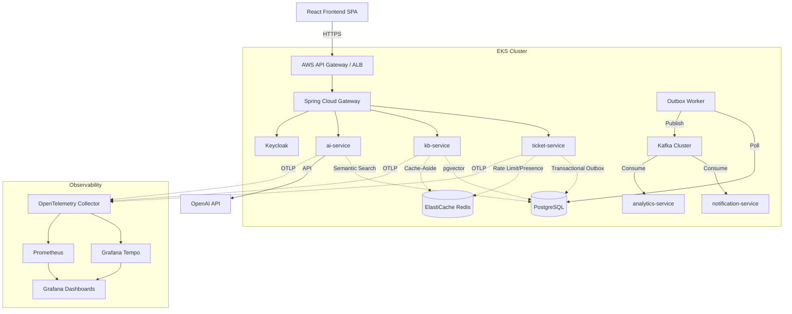

# System Architecture

## Database Design
We avoided MongoDB in favor of PostgreSQL to reduce operational complexity. PostgreSQL acts as our relational store for Tickets and Outbox events, our full-text search engine (`tsvector`) for keyword KB lookups, and our Vector Database (`pgvector`) for Semantic Search.
